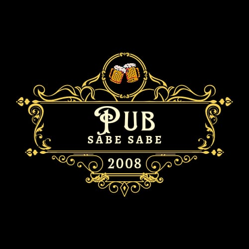

<h1 align="center"> Pub Sabe Sabe </h1>

bar voltado para ambiente de paz, lazer e elegria!

  <a href="#-tecnologias">Tecnologias</a>&nbsp;&nbsp;&nbsp;|&nbsp;&nbsp;&nbsp;
  <a href="#-projeto">Projeto</a>&nbsp;&nbsp;&nbsp;|&nbsp;&nbsp;&nbsp;
  <a href="#-layout">Layout</a>&nbsp;&nbsp;&nbsp;|&nbsp;&nbsp;&nbsp;
  <a href="#memo-licença">Licença</a>

  

 

  

## 🚀 Tecnologias

Esse projeto foi desenvolvido com as seguintes tecnologias:

- HTML e CSS
- JavaScript
- Git e Github
- Figma

## 💻 Projeto

uma pagina de acesso aos conteudos excluisivos do pub.

## :memo: Licença

Esse projeto está sob a licença MIT.

---

Feito por 13luko [Participe da nossa comunidade!](https://github.com/13luko)
